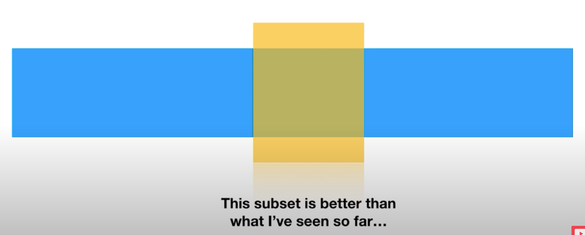
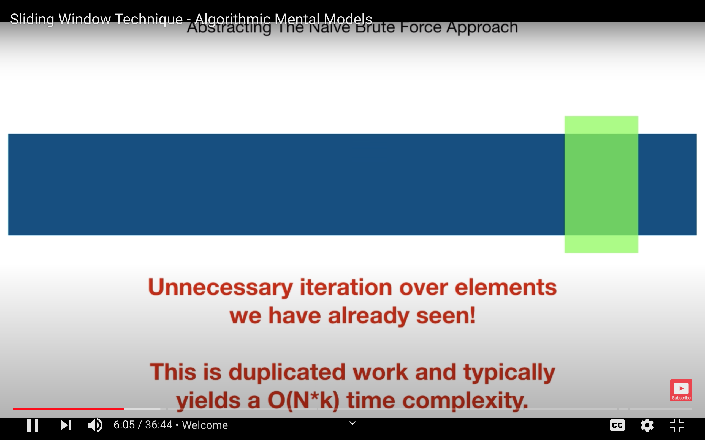
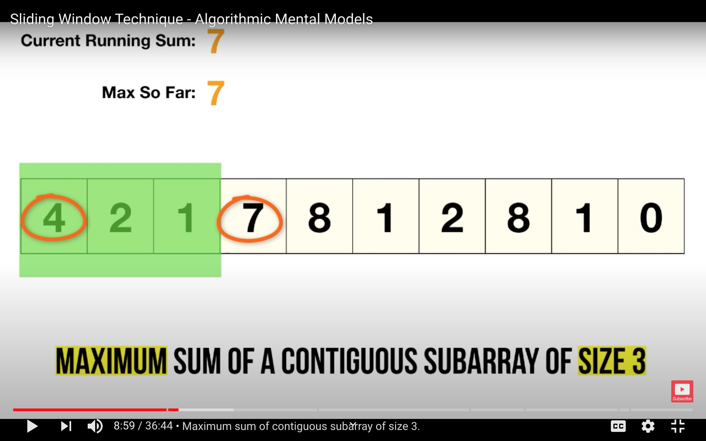
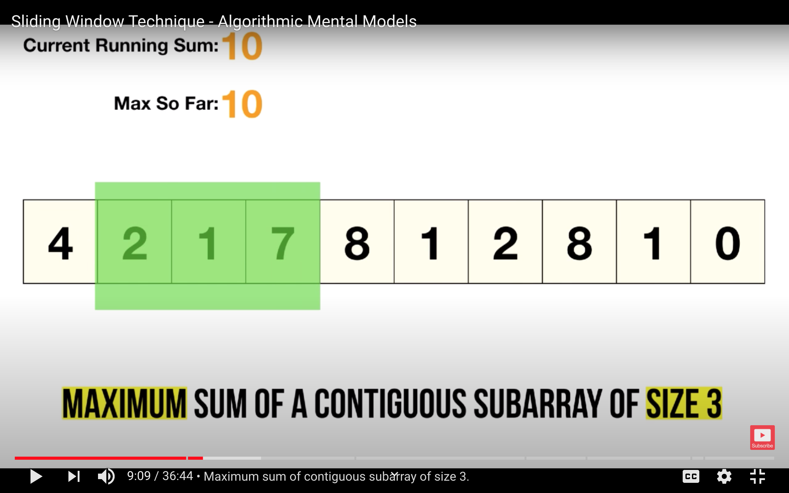

# Sliding Window
Go through this YouTube video get more concepts

https://www.youtube.com/watch?v=MK-NZ4hN7rs
# Fixed Sliding window
Imaging two shape
- Rectangle
    - It can represent array
    - It can represent linked list
    - It can represent any arbitrary sequence of data
    
- Window
    - Subset of array
    - Ask questions
    - Optimize as per question
    - Is this the best I can do?
    - Slide the window over once it is solved for given window subset
    - Test soln in new window and check if this is better subset
    - Keep sliding until best is found
    
This is called fixed sliding window technique.

# Dynamically resizable sliding window
- Window size is growing based on criteria
- It does shrink from left as per problem otimization
- It keeps growing/shrinking
- Eventually it grows to the point at the end of the array
Based on different type of problem we either choose fixed size dynamic window or dynamic size sliding window.
# Abstracting The native brute force approach
- Start the index
- enumurate all possible scope
- This duplicate works

- Optimized sliding window, we get rid of duplicate work
    - Slide over linear time
    - Substract result for the elements no more in sliding window
    - Add data to result based on new sliding window
# Maximum sum of a contiguous subarray of size 3

# How to recognize this pattern?
- Suitable for iterable sequentially
- Related to contiguous sequence of elements
- Good with
    - string
    - array
    - linked list
- Related to 
    - minimum of something
    - maximum of something
    - longest 
    - shortest
    - contains 
    - calculate something for example sum, average etc
# Rolling hash | Rabin karp algorithm | Pattern searching
https://www.youtube.com/watch?v=BQ9E-2umSWc

Key concepts 
- Generate hash based on `26` (or max number of chars) as bas number
- To apply sliding window
    - subtract the value for first position 
    - shift number to right (multiply by `26`)
    - add new value for new char added to sliding window

# Questions Variants
## Fixed length window size
https://www.educative.io/courses/grokking-the-coding-interview/JPKr0kqLGNP

https://leetcode.com/problems/minimum-swaps-to-group-all-1s-together/

## Dynamic window size
https://leetcode.com/problems/minimum-size-subarray-sum/

https://leetcode.com/problems/max-consecutive-ones

https://leetcode.com/problems/max-consecutive-ones-ii/

https://leetcode.com/problems/max-consecutive-ones-iii/

https://leetcode.com/problems/minimum-adjacent-swaps-for-k-consecutive-ones/

## Dynamic window size with auxillary data structure
https://leetcode.com/problems/longest-substring-with-at-most-k-distinct-characters/

https://leetcode.com/problems/longest-substring-with-at-most-two-distinct-characters/

https://leetcode.com/problems/consecutive-characters/

https://leetcode.com/problems/longest-repeating-character-replacement/

https://leetcode.com/problems/minimum-window-substring/

https://leetcode.com/problems/longest-substring-without-repeating-characters/

## Multiple Dynamic window
https://leetcode.com/problems/subarrays-with-k-different-integers/

https://leetcode.com/problems/substring-with-concatenation-of-all-words/

## Pattern matching string problems
https://leetcode.com/problems/longest-duplicate-substring/

## Sounds similar but not a sliding window problem due to additive nature
https://leetcode.com/problems/number-of-submatrices-that-sum-to-target/

https://leetcode.com/problems/subarray-sum-equals-k/

https://leetcode.com/problems/maximum-subarray/

https://leetcode.com/problems/minimum-window-subsequence/

# Commonalities 
- Everything is grouped sequentially
- Longest/smallest/contains/max/min

# Reference 
https://www.youtube.com/watch?v=MK-NZ4hN7rs